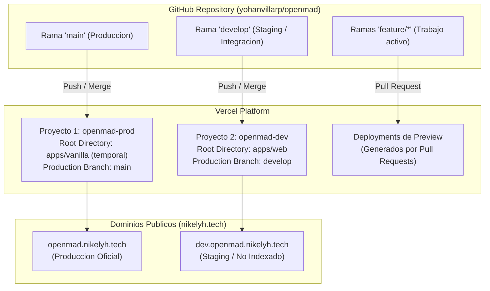

# Guia de Despliegues y Entornos en Vercel (Monorepo)

Este documento describe la arquitectura, la configuracion y el procedimiento operativo estandar para el despliegue de las aplicaciones frontend de OpenMAD en Vercel, separando los entornos de Produccion y Staging/Desarrollo.

---

## 1. Arquitectura de Entornos

El monorepo alberga multiples aplicaciones (`apps/vanilla`, `apps/web`, `backend`). Para los frontends, se utiliza una estrategia de dos proyectos independientes en Vercel vinculados al mismo repositorio de GitHub:



### Tabla de Entornos

| Parametro | Produccion | Staging / Desarrollo | Previews (PR) |
| :--- | :--- | :--- | :--- |
| **Proyecto Vercel** | `openmad-prod` | `openmad-dev` | Heredado de `openmad-dev` |
| **Rama Git** | `main` | `develop` | `feature/*` (via Pull Request) |
| **Directorio Raiz** | `apps/vanilla` *(Fase 1)* / `apps/web` *(Fase 2)* | `apps/web` | `apps/web` |
| **Dominio** | `openmad.nikelyh.tech` | `dev.openmad.nikelyh.tech` | `openmad-*-*.vercel.app` |
| **Indexacion SEO** | Permitida (Publico general) | Bloqueada (`noindex`, `robots.txt`) | Bloqueada por Vercel |
| **Audiencia** | Estudiantes y publico UNAMAD | Desarrolladores y pruebas internas | Revision de codigo en PRs |

---

## 2. Configuracion Paso a Paso en Vercel y DNS

### Paso 2.1: Configuracion DNS (Proveedor de Dominio)

En el panel de administracion donde gestionas el dominio `nikelyh.tech` (Cloudflare, Hostinger, Namecheap, etc.):

1. Crear un registro **CNAME**:
   - **Nombre / Host:** `dev.openmad` (o `dev.openmad.nikelyh.tech`)
   - **Destino / Target:** `cname.vercel-dns.com`
   - **TTL:** Automatico o 3600
   - **Proxy (si usas Cloudflare):** DNS Only (gris) o Proxied con SSL habilitado.

---

### Paso 2.2: Proyecto 1 - Produccion (`openmad-prod`)

Este proyecto ya existe en tu cuenta de Vercel y sirve la version publica:

1. Ir a **Settings > General**:
   - **Project Name:** `openmad-prod` (o renombrarlo si tenia otro nombre).
   - **Root Directory:** Verificar que apunte a `apps/vanilla`.
2. Ir a **Settings > Git**:
   - **Production Branch:** Debe ser `main`.
   - **Ignored Build Step:** Seleccionar *Run a custom bash script* e ingresar:
     ```bash
     ./scripts/vercel-ignore-build.sh apps/vanilla
     ```
3. Ir a **Settings > Domains**:
   - Verificar que este asignado el dominio `openmad.nikelyh.tech`.

---

### Paso 2.3: Proyecto 2 - Staging / Desarrollo (`openmad-dev`)

Crear el nuevo proyecto para la aplicacion moderna React (`apps/web`):

1. En el panel principal de Vercel, hacer clic en **Add New... > Project**.
2. Importar el repositorio `yohanvillarp/openmad`.
3. En la pantalla de configuracion inicial:
   - **Project Name:** `openmad-dev`
   - **Framework Preset:** Vite
   - **Root Directory:** Hacer clic en *Edit* y seleccionar `apps/web`.
4. En **Environment Variables**:
   - Agregar `VITE_APP_ENV` = `staging`
   - Agregar `VITE_API_BASE_URL` = `https://api.openmad.nikelyh.tech/api/v1` (o la URL de desarrollo).
5. Completar la creacion haciendo clic en **Deploy**.
6. Una vez creado el proyecto, ingresar a **Settings > Git**:
   - **Production Branch:** Cambiar de `main` a `develop`.
     *(Importante: Al definir `develop` como Production Branch en este proyecto, cualquier push a `develop` actualizara de inmediato el dominio permanente de staging sin URLs efimeras).*
   - **Ignored Build Step:** Seleccionar *Run a custom bash script* e ingresar:
     ```bash
     ./scripts/vercel-ignore-build.sh apps/web
     ```
7. Ir a **Settings > Domains**:
   - Agregar el dominio: `dev.openmad.nikelyh.tech`.
   - Vercel verificara el CNAME creado en el Paso 2.1 y emitira el certificado SSL automaticamente.

---

## 3. Control de Builds Innecesarios (Ignored Build Step)

En un monorepo, cambios en el backend (`backend/`), configuraciones de GitHub Actions (`.github/`) o documentacion (`docs/`) no deben disparar recompilaciones en los frontends.

El script `scripts/vercel-ignore-build.sh`:
- Evalua si hay diferencias entre el commit actual (`HEAD`) y el anterior (`HEAD^`) en la carpeta indicada.
- Si no hay cambios en la carpeta de la aplicacion ni en los archivos de dependencias raiz (`package.json`, `package-lock.json`), el script finaliza con codigo `0`.
- Vercel interpreta el codigo `0` como una instruccion para ignorar y cancelar el build sin consumir cuota.
- Si hay cambios, finaliza con codigo `1`, permitiendo que el build continue normalmente.

---

## 4. Privacidad y Proteccion de SEO en Staging

Para evitar que Google o Bing indexen datos ficticios, rutas a medio terminar o penalicen el dominio principal por contenido duplicado:

1. **Archivo `robots.txt` (`apps/web/public/robots.txt`):**
   ```txt
   User-agent: *
   Disallow: /
   ```
2. **Cabeceras HTTP (`apps/web/vercel.json`):**
   ```json
   {
     "key": "X-Robots-Tag",
     "value": "noindex, nofollow"
   }
   ```
3. **Proteccion de Acceso (Opcional segun plan Vercel):**
   - En **Vercel Pro**: Se puede habilitar *Deployment Protection > Password Protection* en el proyecto `openmad-dev` para exigir contrasena a los usuarios antes de ver la web.
   - En **Vercel Hobby**: La combinacion de `robots.txt` y `X-Robots-Tag` es la norma tecnica para neutralizar indexaciones no deseadas.

---

## 5. Procedimiento de Transicion: De Vanilla a Web (Fase 2)

Cuando `apps/web` alcance la paridad de funciones, diseno y validacion en `dev.openmad.nikelyh.tech`, se ejecutara el cambio hacia produccion:

```
Paso 1: Abrir Pull Request de 'develop' hacia 'main' con la version final de apps/web.
Paso 2: En 'apps/web/vercel.json', retirar o condicionar la cabecera 'X-Robots-Tag: noindex, nofollow' y actualizar 'robots.txt' para permitir rastreo.
Paso 3: Fusionar el Pull Request en 'main'.
Paso 4: En Vercel Dashboard (Proyecto 'openmad-prod'):
        - Modificar Root Directory: cambiar de 'apps/vanilla' a 'apps/web'.
        - Modificar Ignored Build Step: './scripts/vercel-ignore-build.sh apps/web'.
Paso 5: Vercel recompilara 'apps/web' directamente bajo 'openmad.nikelyh.tech'.
Paso 6: Mover 'apps/vanilla' a 'archive/vanilla' o eliminarlo del repositorio.
```

Este procedimiento garantiza una transicion con cero segundos de inactividad (Zero Downtime) para los usuarios finales.
